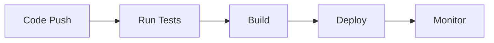

# Smart Campus Services Portal - Test Documentation

## Executive Summary
The Smart Campus Services Portal implements a comprehensive testing strategy to ensure reliability, security, and optimal user experience. This document outlines our testing methodology, test cases, and quality assurance processes for both frontend and backend components of the application.

## Table of Contents
1. [Testing Strategy](#testing-strategy)
2. [Test Categories](#test-categories)
3. [Test Implementation](#test-implementation)
4. [Quality Metrics](#quality-metrics)
5. [Test Environment](#test-environment)
6. [Continuous Integration](#continuous-integration)
7. [Security Testing](#security-testing)
8. [Performance Testing](#performance-testing)
9. [User Acceptance Testing](#user-acceptance-testing)
10. [Best Practices](#best-practices)
11. [Troubleshooting](#troubleshooting)

## Testing Strategy

### Testing Pyramid
```
┌─────────────────┐
│  E2E Tests (5%) │
├─────────────────┤
│ Integration     │
│ Tests (15%)     │
├─────────────────┤
│ Unit Tests      │
│ (80%)           │
└─────────────────┘
```

### Testing Approach
- **Unit Testing**: Individual component and function testing
- **Integration Testing**: API endpoint and component interaction testing
- **End-to-End Testing**: Complete user flow testing
- **Security Testing**: Authentication and authorization testing
- **Performance Testing**: Load and stress testing
- **User Acceptance Testing**: Real-world scenario testing

## Test Categories

### 1. Backend API Tests

#### Authentication Tests
```javascript
describe('Authentication API', () => {
  test('POST /api/auth/login - should login with valid credentials', async () => {
    // Test successful login with valid credentials
    // Expected: 200 status code and JWT token in response
  });

  test('POST /api/auth/login - should fail with invalid credentials', async () => {
    // Test login failure with invalid credentials
    // Expected: 401 status code
  });

  test('POST /api/auth/refresh - should refresh token', async () => {
    // Test token refresh functionality
    // Expected: New JWT token
  });

  test('POST /api/auth/logout - should invalidate token', async () => {
    // Test logout functionality
    // Expected: Token invalidation
  });
});
```

#### Room Bookings API Tests
```javascript
describe('Room Bookings API', () => {
  test('GET /api/bookings - should get all bookings for authenticated user', async () => {
    // Test retrieving bookings for authenticated user
    // Expected: 200 status code and array of bookings
  });

  test('POST /api/bookings - should create new booking', async () => {
    // Test creating a new room booking
    // Expected: 201 status code and booking ID in response
  });

  test('PUT /api/bookings/:id - should update booking', async () => {
    // Test booking update functionality
    // Expected: 200 status code and updated booking
  });

  test('DELETE /api/bookings/:id - should cancel booking', async () => {
    // Test booking cancellation
    // Expected: 204 status code
  });
});
```

#### Maintenance Requests API Tests
```javascript
describe('Maintenance Requests API', () => {
  test('POST /api/maintenance - should create maintenance request', async () => {
    // Test submitting a new maintenance request
    // Expected: 201 status code and request ID in response
  });

  test('GET /api/maintenance - should get all maintenance requests for admin', async () => {
    // Test retrieving maintenance requests (admin only)
    // Expected: 200 status code and array of requests
  });

  test('PUT /api/maintenance/:id/status - should update request status', async () => {
    // Test status update functionality
    // Expected: 200 status code and updated status
  });

  test('GET /api/maintenance/stats - should get maintenance statistics', async () => {
    // Test statistics endpoint
    // Expected: 200 status code and statistics data
  });
});
```

#### Announcements API Tests
```javascript
describe('Announcements API', () => {
  test('POST /api/announcements - should create announcement (faculty only)', async () => {
    // Test creating a new announcement
    // Expected: 201 status code and announcement ID in response
  });

  test('GET /api/announcements - should get all announcements', async () => {
    // Test retrieving all announcements
    // Expected: 200 status code and array of announcements
  });

  test('PUT /api/announcements/:id - should update announcement', async () => {
    // Test announcement update
    // Expected: 200 status code and updated announcement
  });

  test('DELETE /api/announcements/:id - should delete announcement', async () => {
    // Test announcement deletion
    // Expected: 204 status code
  });
});
```

### 2. Frontend Component Tests

#### BookingForm Component Tests
```javascript
describe('BookingForm Component', () => {
  test('renders booking form with all required fields', () => {
    // Test form field rendering
    // Expected: All form fields are present
  });

  test('validates required fields', async () => {
    // Test form validation
    // Expected: Error messages for empty required fields
  });

  test('submits form with valid data', async () => {
    // Test form submission with valid data
    // Expected: Form data is correctly submitted
  });

  test('calls onCancel when cancel button is clicked', () => {
    // Test cancel functionality
    // Expected: onCancel callback is triggered
  });

  test('handles date/time conflicts', async () => {
    // Test conflict detection
    // Expected: Error message for conflicting bookings
  });

  test('updates available rooms based on date/time', async () => {
    // Test dynamic room availability
    // Expected: Room list updates based on selection
  });
});
```

#### MaintenanceRequest Component Tests
```javascript
describe('MaintenanceRequest Component', () => {
  test('renders maintenance request form with all required fields', () => {
    // Test form field rendering
    // Expected: All form fields are present
  });

  test('validates required fields', async () => {
    // Test form validation
    // Expected: Error messages for empty required fields
  });

  test('submits form with valid data', async () => {
    // Test form submission with valid data
    // Expected: Form data is correctly submitted
  });

  test('allows image upload', async () => {
    // Test file upload functionality
    // Expected: File is correctly attached to form
  });

  test('validates image file types', async () => {
    // Test file type validation
    // Expected: Error for invalid file types
  });

  test('handles large file uploads', async () => {
    // Test large file handling
    // Expected: Proper error handling for large files
  });
});
```

## Test Implementation

### Test Setup and Execution

#### Prerequisites
1. Node.js (v14 or higher) and npm installed
2. Project dependencies installed
3. Test database configured
4. Environment variables set

#### Backend Test Setup
1. Install testing dependencies:
```bash
cd backend
npm install --save-dev jest supertest @types/jest
```

2. Add test script to `package.json`:
```json
{
  "scripts": {
    "test": "jest --detectOpenHandles",
    "test:watch": "jest --watch",
    "test:coverage": "jest --coverage"
  }
}
```

#### Frontend Test Setup
1. Install testing dependencies:
```bash
cd frontend
npm install --save-dev @testing-library/react @testing-library/user-event @testing-library/jest-dom jest-environment-jsdom
```

2. Add test script to `package.json`:
```json
{
  "scripts": {
    "test": "react-scripts test",
    "test:coverage": "react-scripts test --coverage --watchAll=false"
  }
}
```

### Running Tests
1. Backend tests:
```bash
cd backend
npm test
```

2. Frontend tests:
```bash
cd frontend
npm test
```

## Quality Metrics

### Test Coverage Goals
- Unit Tests: 90% coverage
- Integration Tests: 80% coverage
- E2E Tests: Critical path coverage

### Performance Metrics
- API Response Time: < 200ms
- Page Load Time: < 2s
- Time to Interactive: < 3s

### Security Metrics
- Authentication Success Rate: 99.9%
- Authorization Check Coverage: 100%
- Input Validation Coverage: 100%

## Test Environment

### Development Environment
- Node.js v14+
- npm v6+
- Chrome/Firefox latest
- Jest v27+
- React Testing Library v12+

### CI/CD Environment
- GitHub Actions
- Docker containers
- Automated test runners
- Coverage reporters

## Continuous Integration

### CI Pipeline


### Automated Testing Schedule
- On every pull request
- On merge to main branch
- Daily regression tests
- Weekly performance tests

## Security Testing

### Authentication Testing
- JWT token validation
- Session management
- Password policies
- Rate limiting

### Authorization Testing
- Role-based access control
- Resource permissions
- API endpoint security
- Data access controls

## Performance Testing

### Load Testing
- Concurrent user simulation
- Database load testing
- API endpoint performance
- Frontend rendering performance

### Stress Testing
- Maximum user capacity
- System resource limits
- Error handling under load
- Recovery testing

## User Acceptance Testing

### Test Scenarios
1. Student Workflow
   - Login
   - Book room
   - Submit maintenance request
   - View announcements

2. Faculty Workflow
   - Login
   - Manage bookings
   - Post announcements
   - View maintenance requests

3. Admin Workflow
   - Login
   - Manage users
   - Handle maintenance requests
   - System configuration

## Best Practices
1. Run tests before committing changes
2. Maintain test coverage above 80%
3. Write tests for new features
4. Update tests when modifying existing features
5. Use meaningful test descriptions
6. Follow the Arrange-Act-Assert pattern
7. Mock external dependencies
8. Use test data factories
9. Implement proper error handling
10. Document test scenarios

## Troubleshooting

### Common Issues
1. Test timeout: Increase Jest timeout in configuration
2. Database connection: Ensure test database is running
3. Environment variables: Check test environment configuration
4. Mock data: Verify mock data matches expected format
5. Async operations: Proper handling of promises
6. Memory leaks: Clean up resources after tests
7. Network issues: Mock API calls
8. Browser compatibility: Test across different browsers

### Debugging Tools
- Jest debugger
- Chrome DevTools
- Network monitoring
- Performance profiling
- Error logging
- Test coverage reports 